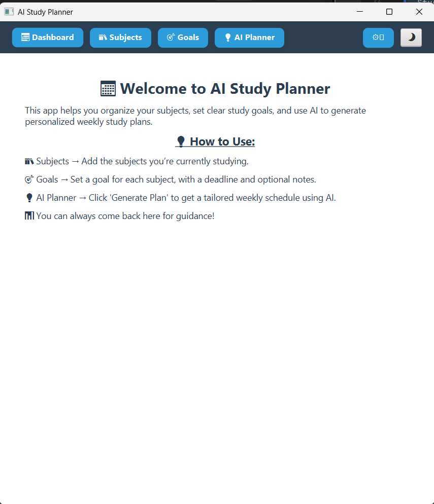
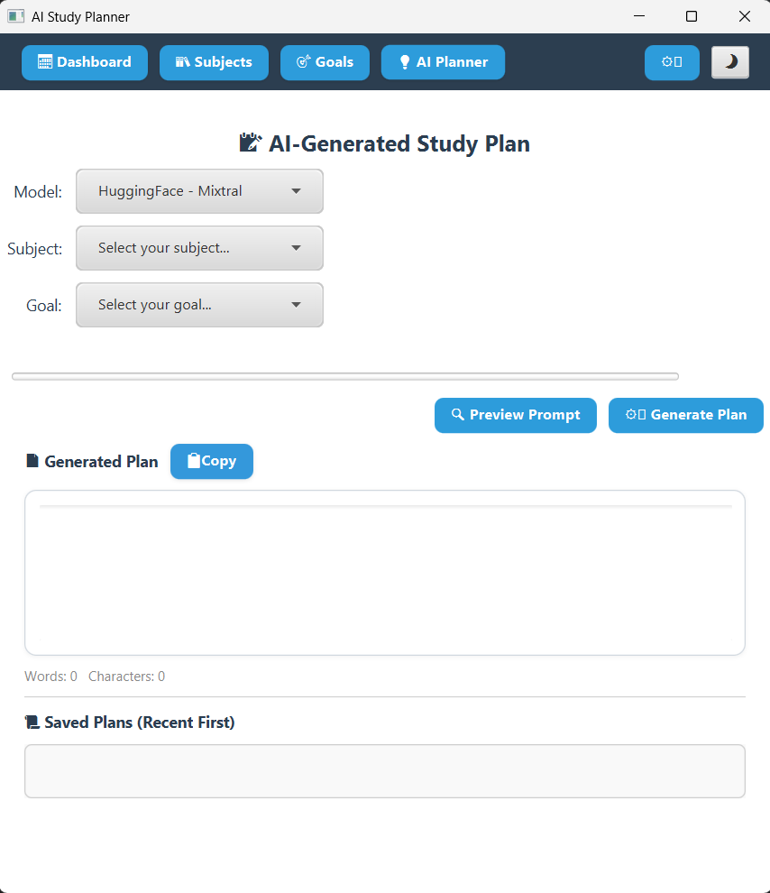
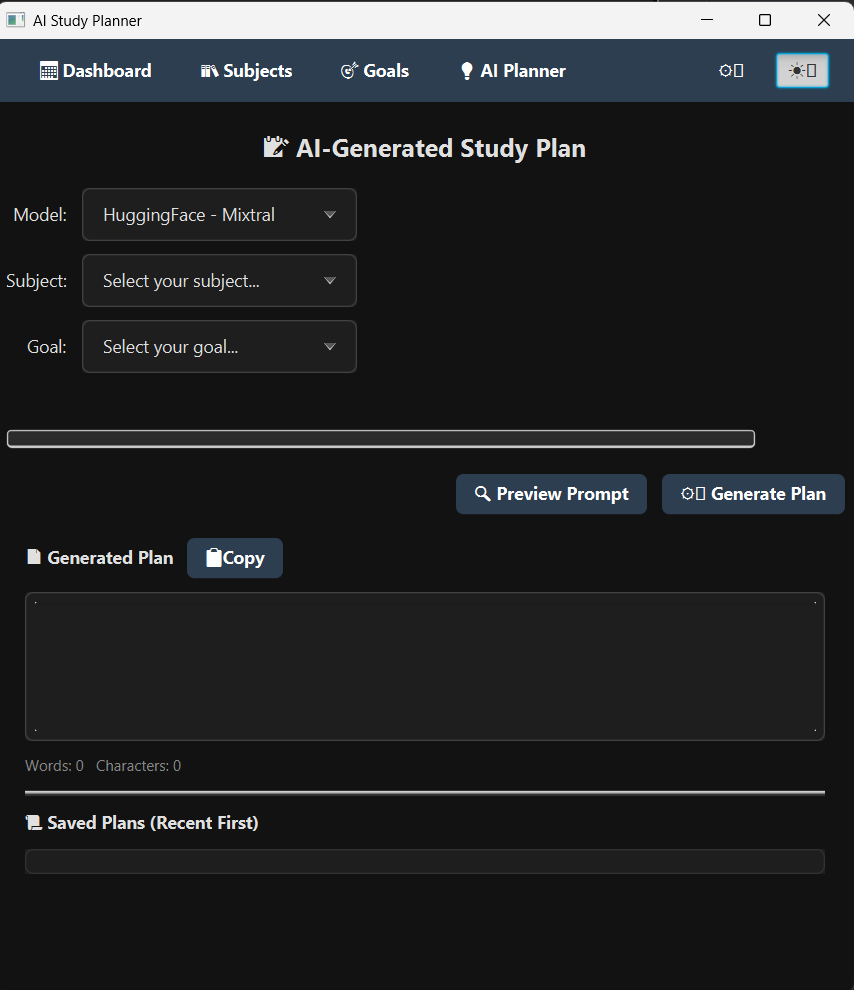

# 📘 AI Study Planner — JavaFX Desktop App + Hugging Face AI

**AI Study Planner** helps students stay organized and on track with smart subject management and AI-powered weekly plans. Built with JavaFX and SQLite, it features a polished UI, modern UX, and seamless integration with Hugging Face's AI API.

---

## 🧠 Features

### 🎯 Subjects & Goals
- Add, edit, and delete **subjects** with notes
- Link multiple **goals** to each subject
- Set **deadlines** and keep track of **goal notes**

### 🤖 AI-Powered Study Plans
- Select a subject and goal → click generate
- Automatically creates a personalized **7-day plan**
- Highlights daily tasks, estimated durations, and a clear summary

### 💡 Smart UI & UX
- Modern JavaFX interface with **light/dark mode** 🌞🌙
- Responsive layout using `VBox`, `GridPane`, and adaptive spacing
- Emoji-powered nav bar:  
  `📅 Dashboard`, `📚 Subjects`, `🎯 Goals`, `💡 AI Planner`
- Tooltips for all controls to guide new users
- **Copy to Clipboard**, **Word/Char Counter**, and **Deadline Progress Bar**

### 🗂️ Local & Persistent
- Data stored locally via **SQLite**
- Full **study plan history** with recent-first ordering
- Instant UI updates on add/edit/delete

---

## 🖼️ Screenshots

### 🌞 Light Mode
  


### 🌙 Dark Mode
  


---

## 🛠️ Tech Stack

| Layer         | Tech Used                          |
|---------------|-------------------------------------|
| Language      | Java 17                             |
| UI Framework  | JavaFX 17.0.15                      |
| API           | Hugging Face Inference API          |
| Database      | SQLite (DAO pattern)                |
| Architecture  | MVC (Model-View-Controller)         |

---

## 🚀 Getting Started

### 1. Clone the Repository
```bash
git clone https://github.com/Roy-Cheong/AIStudyPlanner.git
cd AIStudyPlanner
```

### 2. Prerequisites
- Java 17+
- JavaFX SDK 17.0.15+
- Internet access (for API calls)

### 3. Add Your Hugging Face API Key
Create a file named `hf.key` in the root:
```
hf_abc123yourkey
```

---

## ✅ Roadmap

- [x] Full CRUD for subjects and goals
- [x] AI study plan generator via Hugging Face
- [x] Clean light/dark UI with responsive layout
- [x] Study Plan History, Word Count, Copy Support
- [ ] Export to PDF / Markdown (planned)
- [ ] Custom AI prompt editor (stretch)

---

## 👨‍💻 Author

Made with ☕ + 💻 by **Roy Cheong**
> Learning through building & shipping projects, one app at a time.

---

## 📜 License

**MIT** — free to use, fork, and build on. Attribution appreciated.
```